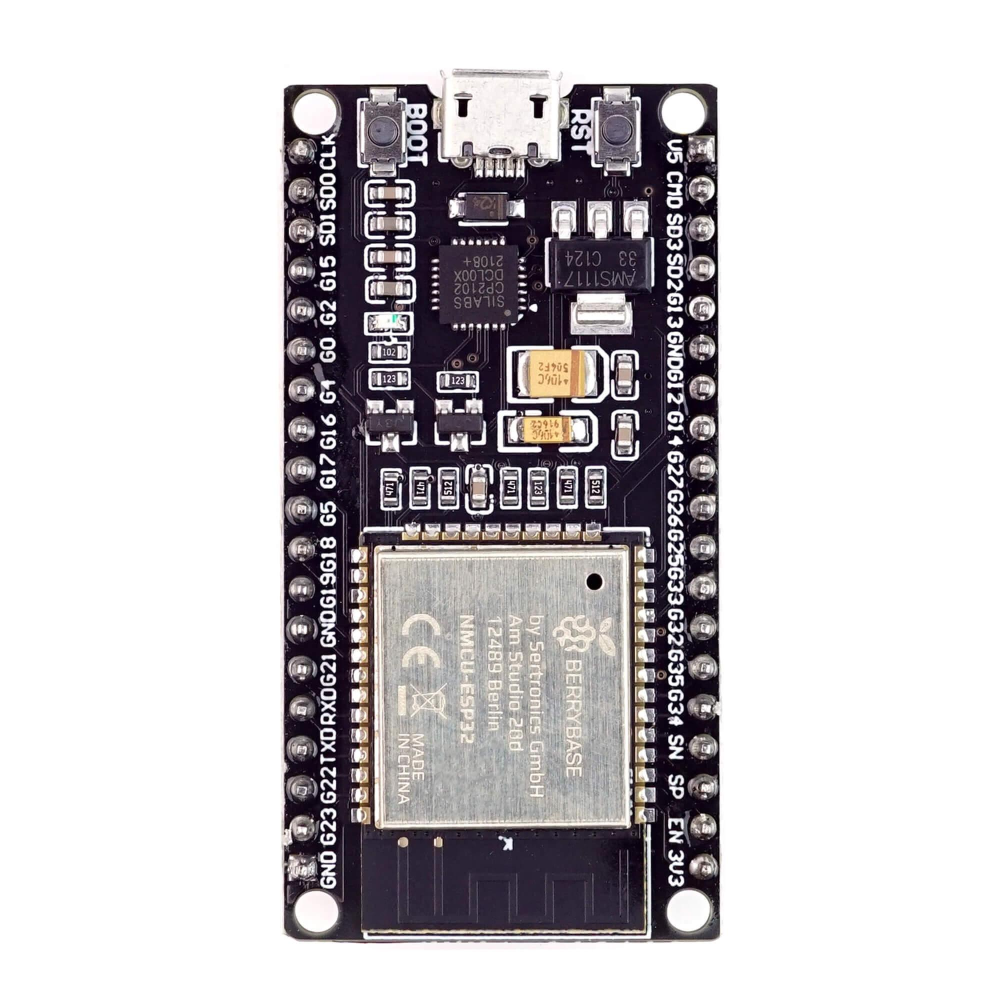

# ESP32 NodeMCU Development Board

Here, I have put some examples for ESP32-NodeMCU-Dev-Board.

### Description:
- Board used: ESP32-NodeMCU-Dev-Board (can be bought from [https://www.berrybase.de/en/esp32-nodemcu-development-board](https://www.berrybase.de/en/esp32-nodemcu-development-board))
- IDE used: Eclipse with Espressif-ESP-IDF plugin [[https://github.com/espressif/idf-eclipse-plugin](https://github.com/espressif/idf-eclipse-plugin)]
- Main file: can be found at ''

## Projects  
| S.No. | Project                      |
|-------|------------------------------|
| 1     | LED_Blink                    |
| 2     | RNG                          |
| 3     | PushButton_OnBoard           |
| 4     | USART                        |
| 5     | ADC_OnBoard3VPinRead         |
| 6     | ADC_OnBoardTemperatureSensor |
| 7     | Timer__                      |
| 8     | FreeRTOS__                   |

### ESP32-NodeMCU-Dev-Board

