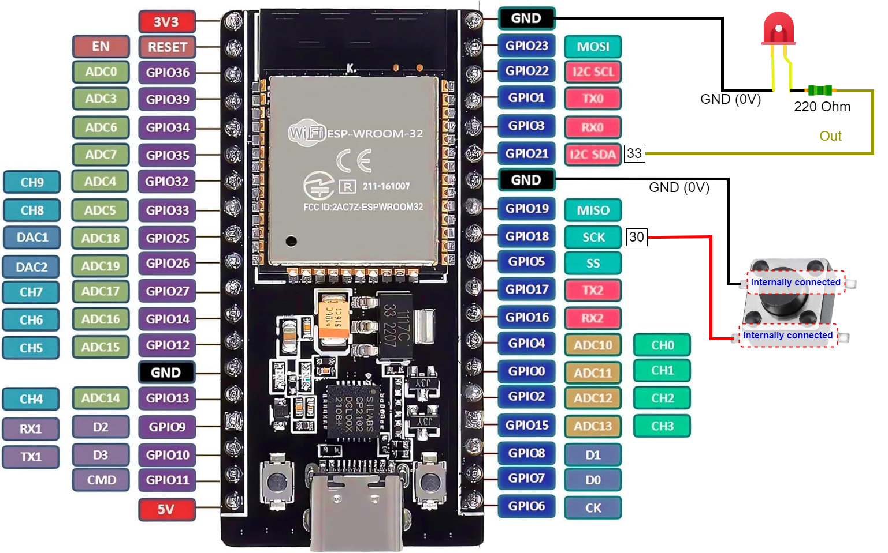

# ESP32 NodeMCU Development Board
Repo rename test!

Here, I have put some examples for ESP32-NodeMCU-Dev-Board.

### Description:
- Board used: ESP32-NodeMCU-Dev-Board
- Chip / MCU: ESP-WROOM-32
- Toolchain (Compile code for ESP32): Espressif ESP-32  
    -> Build tools: CMake and Ninja to build a full App for ESP32  
    -> APIs: ESP-IDF  
- IDE used:
  1. Eclipse with Espressif-ESP-IDF plugin [[https://github.com/espressif/idf-eclipse-plugin](https://github.com/espressif/idf-eclipse-plugin)]  
  2. Espressif-IDE [[https://dl.espressif.com/dl/esp-idf/](https://dl.espressif.com/dl/esp-idf/)]

- ESP-IDF Programming Guide: [https://espressif-docs.readthedocs-hosted.com/projects/esp-idf/en/stable/index.html](https://espressif-docs.readthedocs-hosted.com/projects/esp-idf/en/stable/index.html) or [https://demo-dijiudu.readthedocs.io/en/latest/index.html](https://demo-dijiudu.readthedocs.io/en/latest/index.html)
- Web: [http://esp32.net/](http://esp32.net/)

# # Projects  
| S.No. | Project                      | IDE used      |
| ----- | ---------------------------- | ------------- |
| 1     | LED_Blink                    | Eclipse       |
| 2     | RNG                          | Eclipse       |
| 3     | PushButton_OnBoard           | Eclipse       |
| 4     | USART                        | Eclipse       |
| 5     | ADC_OnBoard3VPinRead         | Eclipse       |
| 6     | ADC_OnBoardTemperatureSensor | Eclipse       |
| 7     | Timer__                      | Eclipse       |
| 8     | FreeRTOS__                   | Eclipse       |
| 9     | Button_N_LED                 | Espressif-IDE |
| 10    | ADC_Potentiometer            | Espressif-IDE |

## ESP32 WROOM Generic DevKit

### ESP32-NodeMCU-Dev-Board

# Projects Schematics  
## Button_N_LED

## ADC_Potentiometer

#### ##### END OF FILE \###############
